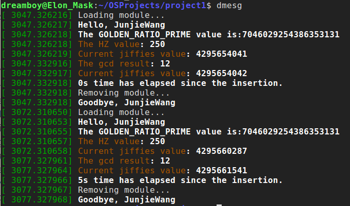
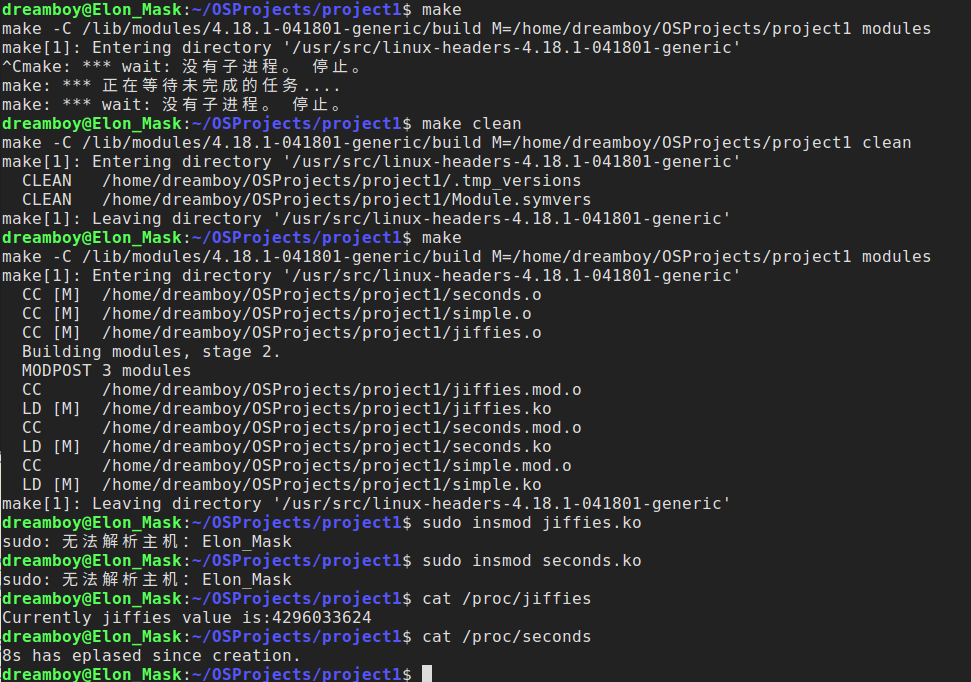

## Project1: Brief Introduction For Kernel Module
> This part is about some basic knowedge about Linux Kernel Module  
### Features
* *do not execute sequentially*(do not have a main function), use `init` and `exit` instead.
* *do not have automatic cleanup*(resources must be released manually)
* *do not have `printf()` function*, since that is for the user space
* *can be interruppted and* accessed by multiple users at the same time, so consistent behavior must be ensured.
* *more CPU cycles will be assigned to the kernel module *
* *do not have floating-point support* since it is kernel code that uses traps to transitions from integer to fp

### Makefile
make -C argument: specify the directory which it will enters(here the source code directory)
make M=$(PWD) (M is the variable to be passed on to the Makefile in -C directory so that it will jump back to current directory)
### Specify parameters
`module_param(name, type, permission)`(the `type` specifies the type(e.g. charp) and permission can be specified as (S_INUGO))
### where to find the output
* `/sys/module/$(moduleName)`
* `/var/log/kern.log` (use `tail -f /var/log/kern.log`)
* `/proc` (simply use `cat /proc/modules | grep simple` to grep the output)

## Implementation Tutorial
### Part A: Hello world!
> source code is available in project1/simple.c
#### Step 1: Basic framework of a LKM
&emsp;&emsp;The simplest version of a LKM only has an entry and exiting point.
``` C
/* entry point */
/* in kernel space we don't have functions
   printf() which is from user space. We use
   printk() instead */
static int __init simple_init(void){
    printk("Loading module...\n");
    return 0;
}

static void __exit simple_exit(void){
    printk("Removing module...\n");
}

/* specify the entry point and exiting point */
module_init(simple_init);
module_exit(simple_exit);
```
#### Step2: Write a makefile
&emsp;&emsp;We have to write a makefile to get our simple.ko module
``` shell
# use subtle rule (make will find simple.c automatically)
obj-m += simple.o
# -C specify where the make will go(/lib/modules/...) and M=$(PWD)
# means that make will come back to currect directory once it finishes
# compiling in /lib/modules/...
all:
  make -C /lib/modules/$(shell uname -r)/build M=$(PWD) modules

clean:
  $(RM) simple.o simple.ko  
```

#### Step3: Using kernel space variables and functions
``` C
#include <linux/jiffies.h>
#include <linux/gcd.h>
...
static int __init simple_init(void){
  printk("The GOLDEN_RATIO_PRIME value is:%llu\n",  GOLDEN_RATIO_PRIME);
  printk("Currently the jiffies value is:%lu\n", jiffies);
  printk("HZ value is: %d\n", HZ);
  return 0;
}

static void __exit simple_exit(void){
  /* get the maximum common divisor of 3300 and 24 */
  printk("The maximum common divisor of 3300 and 24 is:%lu\n", gcd(3300, 24));
  printk("Currently the jiffies value is %lu\n", jiffies);
}
...
```

#### Step4: Insert the Module
* Run `make` and compile your module. A common error in this step is that `Can not find directory.... Run make oldconfig to fix it`. This is usually because of incomplete kernel header code. A possible solution(work for me) is to re-install your kernel module(or simply update to another version, this can be done by simply using .deb files in ubuntu).
* `sudo insmod simple.ko`
* You can see your module using `lsmod | grep simple` or `cat /proc/modules | grep simple`
* `sudo rmmod simple`(remove the kernel module)
* Output is as follows(I add some extra logic here and you can refer to the source code)

<center></center>

### Part B: The /proc file system
> &emsp;&emsp;The /proc file system is a “pseudo” file system that exists only in kernel memory and is used primarily for querying various kernel and per-process statistics. Here I only show how to use HZ and jiffies to get the time interval, source code is available at project1/seconds.c

``` C
#include <linux/init.h>
#include <linux/module.h>
#include <linux/jiffies.h>
#include <linux/kernel.h>
#include <linux/proc_fs.h>
#include <asm/uaccess.h>
#include <linux/uaccess.h>

#define BUFFER_SIZE 128
#define PROC_NAME "seconds"

static long unsigned int start, end;

static ssize_t proc_read(struct file *file, char __user *usr_buf, size_t count, loff_t *pos);

static struct file_operations proc_ops = {
        .owner = THIS_MODULE,
        .read = proc_read,
};

static int proc_init(void)
{
    /* this will create /proc/seconds file */
    proc_create(PROC_NAME, 0666, NULL, &proc_ops);
    printk(KERN_INFO "/proc/%s created\n", PROC_NAME);
    start = jiffies;

    return 0;
}

static void proc_exit(void)
{
    /* remove the /proc/seconds file */
    remove_proc_entry(PROC_NAME, NULL);

    printk(KERN_INFO "/proc/%s removed\n", PROC_NAME);
}

/* the function will be called whenever the user use
  command cat /proc/seconds or other methods to read /proc/seconds.
  Its counterpart is `proc_write`, which will be shown in project2 */
static ssize_t proc_read(struct file *file, char __user *usr_buf, size_t count, loff_t *pos)
{
    int rv = 0;
    static int completed = 0;
    char buffer[BUFFER_SIZE];

    /* since when user call cat /proc/seconds,
      proc_read() function will be called repeated until
      it returns 0, we have this logic to return 0 once the data is collected */
    if(completed){
        completed = 0;
        return 0;
    }

    completed = 1;

    end = jiffies;
    rv = sprintf(buffer, "%lus has eplased since creation.\n", (end-start)/HZ);

    /* copy the user space */
    copy_to_user(usr_buf, buffer, rv);
    return rv;
}

module_init(proc_init);
module_exit(proc_exit);

MODULE_LICENSE("GPL");
MODULE_DESCRIPTION("Jiffies module");
MODULE_AUTHOR("Junjie Wang");
```
&emsp;&emsp;Output is as follows:

<center></center>
